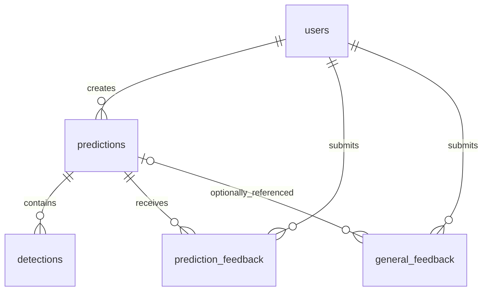

# Architecture and tradeoffs

## Request flow

Browser → React → FastAPI → JWT identity and database-backed RBAC → prediction route → shared YOLO service → prediction + detection rows / controlled image storage → history, analytics, feedback.

The frontend talks to a stable JSON API. Model loading and inference are isolated from HTTP concerns. Images are never mounted as a public static directory: the API checks ownership before sending each image, and the frontend creates temporary object URLs from authorized responses.

## Ten decisions to explain

1. **Load and warm once per process.** Loading weights on each request wastes time and memory. FastAPI lifespan initializes the service once; a failed initialization produces a degraded health state without replacing real inference with fake output.
2. **Protect mutable inference state.** The Ultralytics predictor is shared, so a lock serializes calls. CPU execution works on Apple Silicon without CUDA. This trades peak throughput for reliability at demo scale.
3. **Separate serving from model implementation.** `BaseModelService` defines load/predict/health; `YOLODetectionService` implements it. An alternative model could use the same route and storage contract later.
4. **Normalize useful ML facts.** Each detected class, confidence, and coordinate is a relational row. Predictions retain version, latency, source, status, threshold, and provenance. History and analytics can query facts rather than opaque JSON.
5. **Use configurable SQLAlchemy persistence.** SQLite simplifies a local demo. `DATABASE_URL` and portable queries prepare a PostgreSQL path. Migration of schema/data remains explicit future work.
6. **Abstract storage while retaining access control.** A local image storage interface controls keys and metadata removal. Object storage can replace it later, but must preserve owner/admin authorization and retention semantics.
7. **Keep quality and operations separate.** Published mAP is sourced reference information, not an application evaluation. P50/P95, traffic, errors, and confidence distribution measure operations; none proves detection accuracy.
8. **Make human feedback traceable.** Append-only judgments connect user, image, prediction, model version, and timestamp. Admin review records reviewer and current disposition. It is data collection/triage; training is not triggered.
9. **Enforce authorization at the server.** UI route guards improve usability, while API dependencies and ownership checks actually protect data, including images and metrics. Roles are not trusted from the browser or JWT claims.
10. **Decouple telemetry from the UI and infrastructure.** Database analytics survive restart and drive the app. Process counters/histograms support a future Prometheus scraper. Neither Prometheus nor Grafana must run during the interview.

## Latency and percentile definitions

See the README for timing boundaries. Percentiles use linear interpolation over successful persisted samples, with demo records included only if selected. Low sample counts should not be interpreted as reliable production latency estimates. Model warm-up occurs before requests. The inference timer excludes lock wait; request processing includes queueing after request entry.

## Schema relationships

## Deployment boundaries

Static frontend hosting can serve the Vite build. A separate container must own the long-lived model process, secrets, database connections, and storage authorization. Cloud deployment additionally needs persistent model/storage volumes or artifact downloads at build/setup, PostgreSQL migrations, an object-storage adapter, TLS, account lifecycle, rate limits, backups, and retention. Those are deployment tasks, not prerequisites to the local demo.
